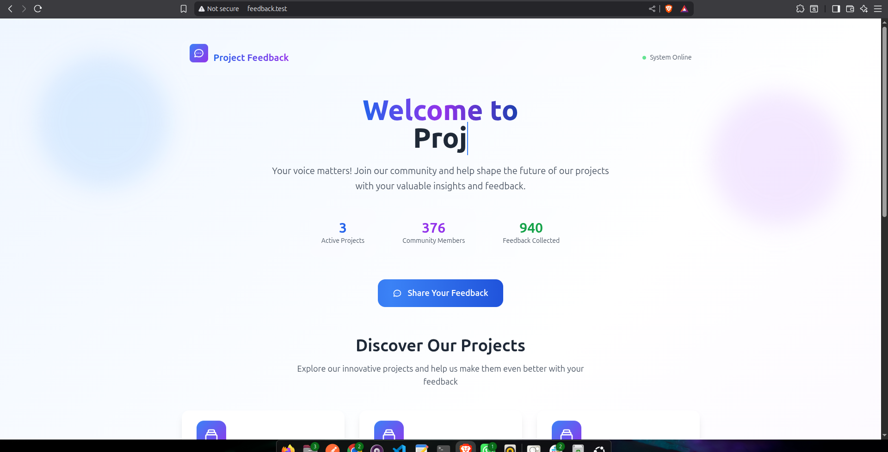
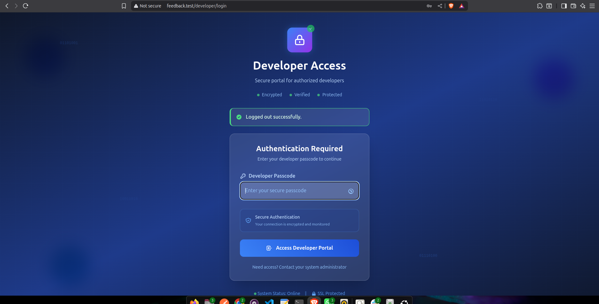
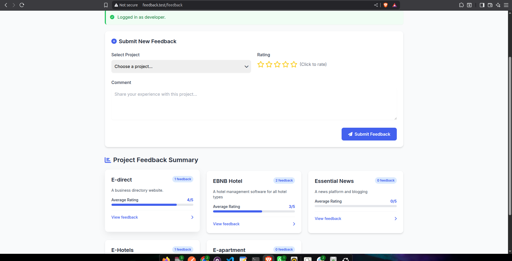

---

#  Project Feedback System

The **Project Feedback System** is a full-stack web application that allows users to submit feedback on various projects, while developers can view and respond to that feedback with status updates.

It consists of:

* **Front-End**: A Laravel (Blade-based) UI for users and developers.
* **Back-End**: A Laravel API that handles project, feedback, and developer response data.

---

##  GitHub Repositories

* 🔸 Front-End: [website\_feedback\_system\_frontend](https://github.com/hardeex/website_feedback_system_frontend)
* 🔸 Back-End: [website\_feedback\_system\_backend](https://github.com/hardeex/website_feedback_system_backend)

---

##  Table of Contents

* [Prerequisites](#prerequisites)
* [Front-End Setup](#front-end-setup)
* [Back-End Setup](#back-end-setup)
* [Usage](#usage)

  * [General Users](#general-users)
  * [Developers](#developers)
* [API Endpoints](#api-endpoints)
* [Debugging Tips](#debugging-tips)
* [Security Notes](#security-notes)
* [Future Improvements](#future-improvements)

---

##  Prerequisites

Ensure the following are installed:

* **PHP**: 8.1 or higher
* **Composer**: Latest version
* **Node.js**: 16.x or higher
* **MySQL**: 5.7+
* **Git**: For cloning repos
* **Web Server**: Apache, Nginx, or Laravel’s built-in server
* **Browser**: Chrome, Firefox, etc.

---

##  Front-End Setup

### 1. Clone Repository

```bash
git clone https://github.com/hardeex/website_feedback_system_frontend.git
cd website_feedback_system_frontend
```

### 2. Install Dependencies

```bash
composer install
npm install
```

### 3. Configure Environment

```bash
cp .env.example .env
```

Update `.env` with:

```env
APP_URL=http://feedback.test
API_BACKEND_URL=http://backend-project-feedback.test/api
DEVELOPER_PASSCODE=secret123
SESSION_DRIVER=file
SESSION_LIFETIME=120
```

Ensure `APP_URL` matches your local domain (e.g., `http://feedback.test`).

### 4. Generate App Key

```bash
php artisan key:generate
```

### 5. Set Permissions

```bash
chmod -R 775 storage
chmod -R 775 bootstrap/cache
```

### 6. Compile Assets

```bash
npm run dev
```

### 7. Clear Caches

```bash
php artisan config:clear
php artisan cache:clear
```

### 8. Run the App

```bash
php artisan serve
```

Then open `http://feedback.test` in your browser.

---

##  Back-End Setup

### 1. Clone Repository

```bash
git clone https://github.com/hardeex/website_feedback_system_backend.git
cd website_feedback_system_backend
```

### 2. Install Dependencies

```bash
composer install
```

### 3. Configure Environment

```bash
cp .env.example .env
```

Update `.env` with:

```env
APP_URL=http://backend-project-feedback.test
API_BACKEND_URL=http://backend-project-feedback.test/api
DEVELOPER_PASSCODE=secret123

DB_CONNECTION=mysql
DB_HOST=127.0.0.1
DB_PORT=3306
DB_DATABASE=project_feedback
DB_USERNAME=root
DB_PASSWORD=
```

Make sure `DEVELOPER_PASSCODE` matches the front-end config.

### 4. Set Up Database

* Create a database: `project_feedback`
* Run migrations and optional seeders:

```bash
php artisan migrate
php artisan db:seed
```

### 5. Generate App Key

```bash
php artisan key:generate
```

### 6. Set Permissions

```bash
chmod -R 775 storage
chmod -R 775 bootstrap/cache
```

### 7. Configure CORS

Update `config/cors.php`:

```php
return [
    'paths' => ['api/*'],
    'allowed_methods' => ['GET', 'POST', 'PUT', 'DELETE'],
    'allowed_origins' => ['http://feedback.test'],
    'allowed_headers' => ['Content-Type', 'X-CSRF-TOKEN', 'X-Developer-Passcode'],
    'exposed_headers' => [],
    'max_age' => 0,
    'supports_credentials' => false,
];
```

### 8. Clear Caches

```bash
php artisan config:clear
php artisan cache:clear
```

### 9. Run the API

```bash
php artisan serve --host=backend-project-feedback.test
```

Test in browser or Postman:

```
GET http://backend-project-feedback.test/api/projects
```

---

##  Usage

###  General Users

* **Visit**: `http://feedback.test`
* **Submit Feedback**:

  * Go to `/feedback`
  * Select project, enter rating/comment, and submit
* **View Projects**:

  * See summary stats
  * Click “View Feedback” to view detailed responses (read-only)

### Developers

* **Login**:

  * Visit `/developer/login`
  * Enter passcode: `secret123`
* **View & Respond**:

  * Click “View Feedback” > “Respond”
  * Add a response and status (e.g., *Fixed*)
* **Logout**:

  * Click "Logout" button

---

## API Endpoints

Base URL: `http://backend-project-feedback.test/api`

| Method | Endpoint                       | Description                                                    |
| ------ | ------------------------------ | -------------------------------------------------------------- |
| GET    | `/projects`                    | List all projects                                              |
| GET    | `/projects/{project}`          | Get a specific project                                         |
| GET    | `/projects/{project}/feedback` | Paginated feedback (requires developer passcode for full data) |
| POST   | `/projects/{project}/feedback` | Submit feedback                                                |
| PUT    | `/feedback/{feedback}`         | Add developer response and status                              |

###  Headers for Developer Endpoints:

```
X-Developer-Passcode: secret123
X-CSRF-TOKEN: {your-csrf-token}
```

---

##  Debugging Tips

###  Front-End Logs

Check:

```bash
storage/logs/laravel.log
```

Sample log:

```
[2025-08-28 15:35:00] local.DEBUG: Developer login attempt {
  "entered_passcode":"secret123"
}
```

###  Back-End Logs

```bash
storage/logs/laravel.log
```

Sample log:

```
[2025-08-28 15:35:00] local.DEBUG: Feedback fetch attempt {
  "header_passcode":"secret123"
}
```

###  Browser Dev Tools

* Open Console:

  * Look for feedback fetch logs
* Network tab:

  * Check status, request headers, and responses

###  Passcode Not Working?

Run:

```bash
php artisan tinker
>>> config('api.developer_passcode')
```

Ensure it returns: `secret123`

---

##  Security Notes

* **Passcode Authentication** is insecure for production.

  * Use Laravel Sanctum, Passport, or OAuth.
* **CSRF Protection**: Required on `PUT`/`POST` requests with `X-CSRF-TOKEN`.
* **CORS Configuration**: Ensure allowed origins match exactly — no trailing slashes!

---

##  Future Improvements

*  Load More: Paginated feedback in modals
*  Edit Responses: Allow updates to developer responses
* Notifications: Success alerts on actions
*  Auth Upgrade: Use Sanctum or Passport
*  Input Sanitization: Improve protection against malicious input

---





